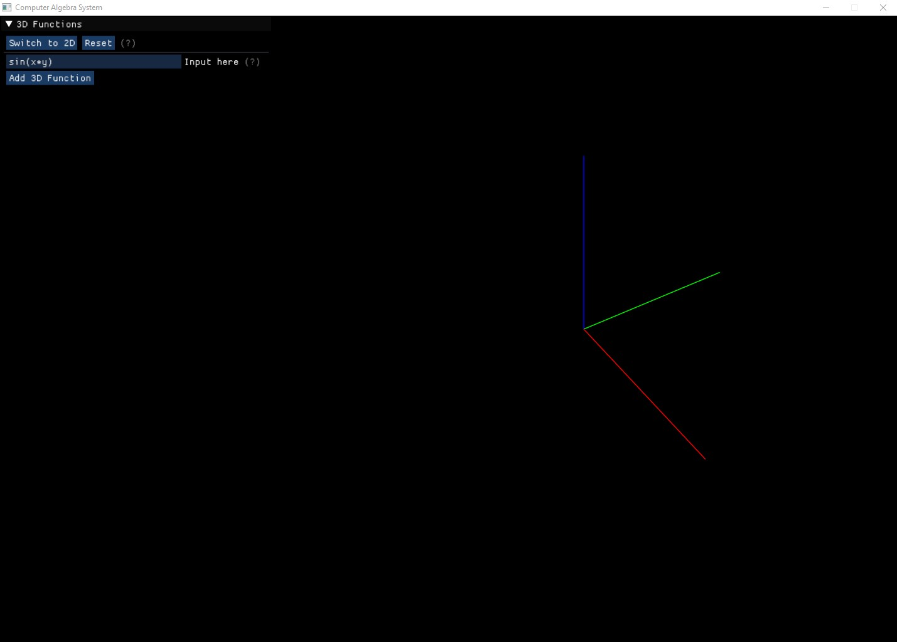

# Computer-Algebra-System

This project is a [Computer Algebra System](https://en.wikipedia.org/wiki/Computer_algebra_system) coded in Java from
scratch in Eclipse. It supports the majority of elementary functions.

## Table of Contents

- [Computer-Algebra-System](#computer-algebra-system)
    - [Table of Contents](#table-of-contents)
    - [Presentation](#presentation)
    - [How to use it & What is Supported](#how-to-use-it--what-is-supported)
    - [References & Dependencies](#references--dependencies)

This Computer Algebra System contains:

* A tree-like data structure to hold any mathematical expression in memory. This is the core of the project and consists
  of more than half of it.
* Parsing any mathematical expression into this expression tree.
* Display this mathematical expression beautifully using LaTeX.
* Simplify this expression algebraically.
* Find the symbolic partial derivatives of the mathematical expression with respect to any variable.
* Graph the expression in both 2D and 3D.

Future improvement goals:

* Complex numbers
* Taylor expansions
* Root finding via the Bisection method or Newton's method
* Limits
* Numerical integration using Riemann Sums or Monte Carlo methods
* Symbolic single variable and multivariate integration
* Numerical differentiation
* Probabilistic and statistical distributions
* Linear Algebra support
* Differential Equations support

___

## Presentation

Here is what it looks like when you launch the application. It defaults to the 3D plotter, you can switch between the 3D
and 2D plotter with the button on the top left corner.

Here is an example with a single function of
form . You can see the system automatically
computes both partial derivatives of the function and gives the option to plot them too. Functions of
form  are possible too if you switch to the 2D
plotter. You can plot as many functions as you want, the true limit is either memory or GPU power.

___

## How to use it & What is Supported

To zoom in or out of a model, use the mouse wheel. To move the model, click and drag the model around. This applies for
both the 2D and 3D contexts.

Here is a list of the supported functions, examples of syntax the parser can understand and how the parser will
translate it. For most functions, brackets are necessary if the input is not a number or a variable. Unless stated
otherwise. Also, the multiplication symbol is mandatory. An expression like "5x" will not work, it must be "5 * x".

* Trigonometry: Write the name of the function and then the input.
    * sin, cos and tan. Examples:
        * "x * sinx" &rarr; 
        * "a * x * cos(b * x)" &rarr; 
    * arcsin, arccos, arctan. Examples:
        * "arcsin(a / x)"
          &rarr; 
        * "arctanx" &rarr; 
    * csc, sec, cot. Examples:
        * "csc(x + b)" &rarr; 
        * "cotx + b" &rarr; 

* Floor function. Examples:
    * "floorx" &rarr; 
    * "floor(x^2 + 15)"
      &rarr; 
* Ceiling function. Examples:
    * "ceilx" &rarr; 
    * "ceil(5 * b * x + 0.1)"
      &rarr; 
* Absolute value function. Examples:
    * "absx" &rarr; 
    * "abs5" &rarr; 
    * "abs(x^3)" &rarr; 
* Logarithms. Examples:
    * "lnx" &rarr; 
    * "ln(5 * x)" &rarr; 
    * "logx" &rarr; 
    * "log_5_x" &rarr; 
    * "log_(x + 5)_(x^2)" &rarr; 
      &nbsp;&nbsp; This is a complex log, rarely ever used but supported.
* Minimum and Maximum functions. These functions take an arbitrary amount of inputs (more than 1 of course). You must
  surround those inputs in brackets and separate them with commas. Examples:
    * "min(5, x)" &rarr; 
    * "max(x, x^2, 15, 7 / x)"
      &rarr; 
    * "min(17, x^3, 7 * x)"
      &rarr; 
* Modulus function. This function must take 2 inputs, separated by a comma and must be surrounded by brackets. Examples:
    * "mod(x, 5)" &rarr;  &nbsp; or
      &nbsp; 
      %  &nbsp; for computer scientists
    * "mod(x^2 + x + 15, x^3)"
      &rarr; 
* Sign function. Examples:
    * "signx" &rarr; 
    * "sign(-x + 5)" &rarr; 
    * "sign(x^2 + x - 15)"
      &rarr; 

___

## References & Dependencies

The following are all the libraries I used. They are all included inside the project as raw Jar files. Eclipse took care
of adding them to the Build Path. I downloaded all the dependencies with a Windows 64-bit system in mind. You might need
to download other jars if you run another type of system.

* [LWJGL3](https://www.lwjgl.org/): I used LWJGL to render the 2D and 3D plots. The native files are included in the
  lib/natives folder.
* [ImGui](https://github.com/ocornut/imgui): I used Dear ImGui for the GUI. This is a C++ library so I used the JNI
  based binding from [here](https://github.com/SpaiR/imgui-java). The native jars ar in the lib/natives folder.
* [Commons Lang](http://commons.apache.org/proper/commons-lang/) from Apache Commons: I used this library for String
  manipulation in the parser.
* [JLatexMath](https://github.com/opencollab/jlatexmath): I use this library to render the latex code generated by the
  mathematical expression or the expression tree.
* [Jafama](https://github.com/jeffhain/jafama): I used this library for faster math calculations than the built in Math
  class in java. You can see [here](https://www.element84.com/blog/improving-java-math-performance-with-jafama) the
  differences between Jafama's FastMath class and Java's Math class.